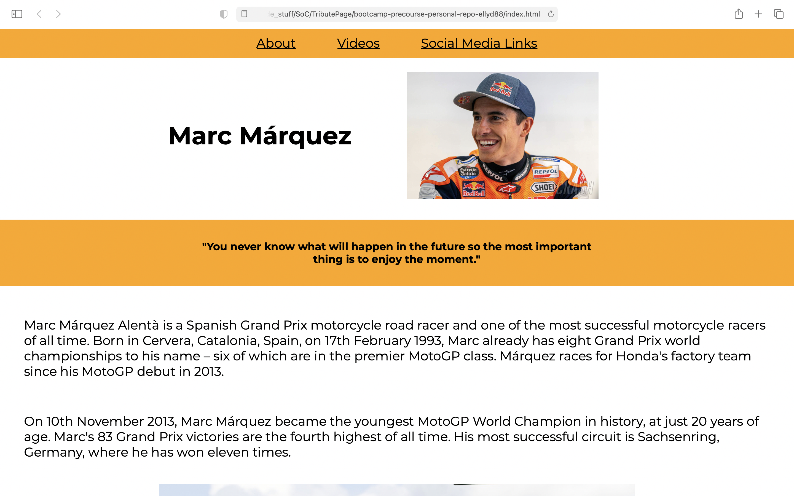
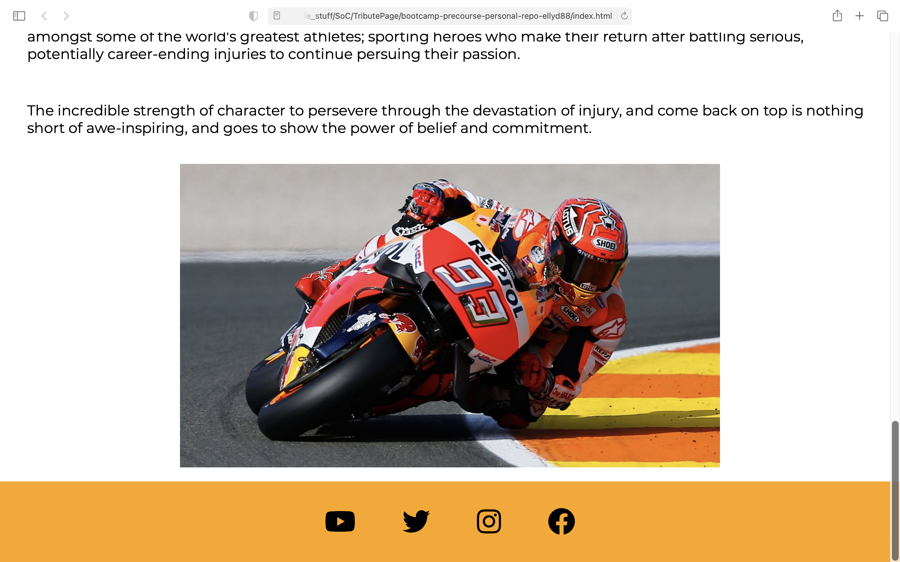

# Tribute Page

## This is my first webpage created as part of the responsive web design course from freecodecamp.

Here are some screenshots to preview the page:

I chose to write the page about Marc Marquez as I am a big fan of MotoGP racing, and I find his passion and approach inspiring.

I have learned that following steps in an online-course environment is completely different to making something from scratch as you are no longer spoon-fed the answers. I have had to repeat many lessons. In particular, I found it difficult to position elements on the page, and my approach was a lot more "trial and error" rather than feeling confident in what I was doing. I think the key to progress will be practise!

My tribute page is still in development, as I had made some social media links which displayed fine in codepen, but when I copied the code to Visual Studio Code, they no longer show up.

Edit: Ok, I think I fixed the social media links.... they are visible now 😀!

Perhaps once I have learned some JavaScript, I will be able to add this to make the page more interesting. So - a work in progress.
